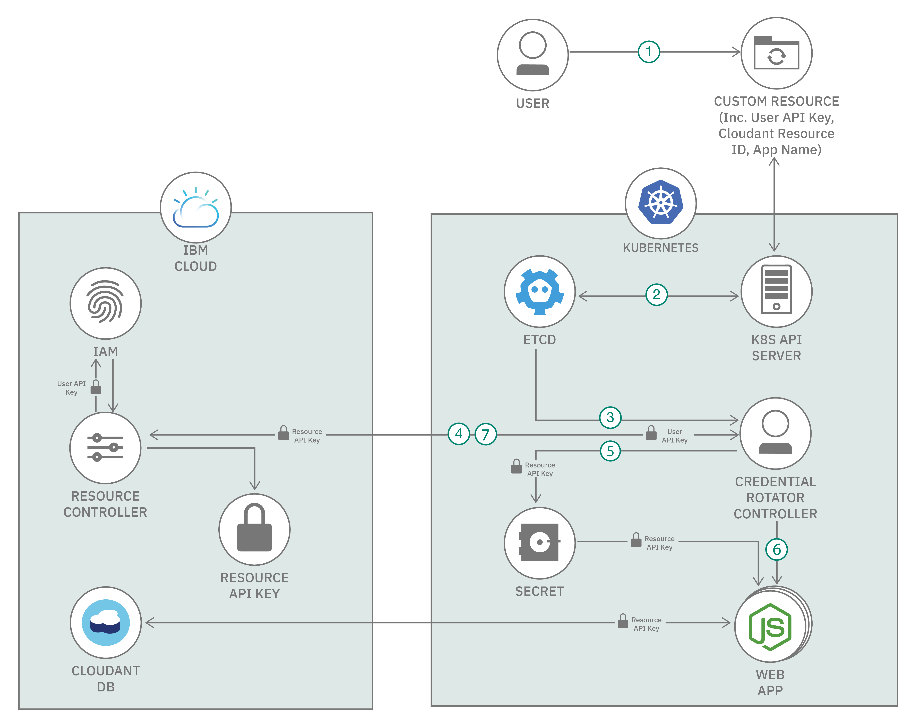
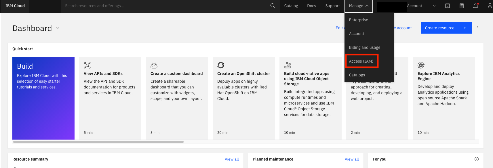
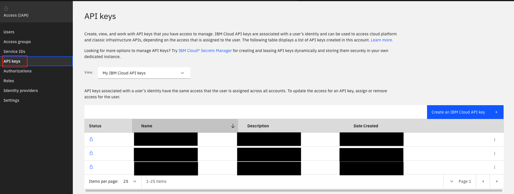
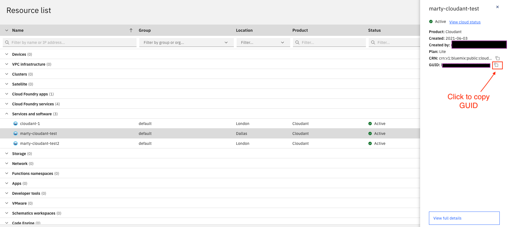
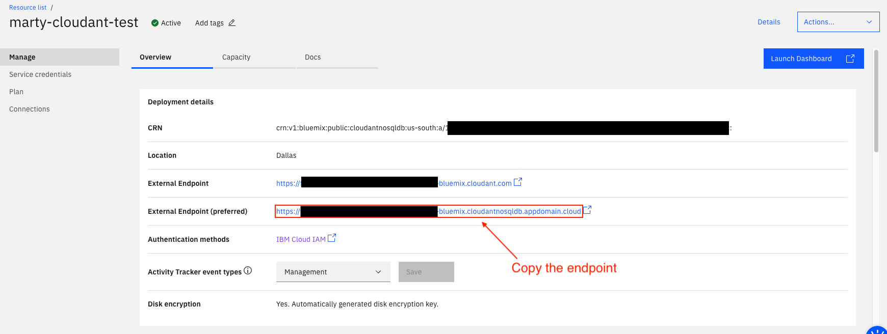
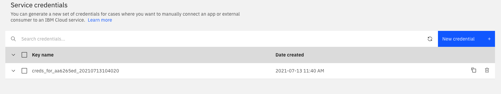

# Credential Rotator Operator

## Overview

The credential rotator operator was scaffolded via the [Operator SDK](https://sdk.operatorframework.io), and when the Custom Resource (CR) `CredentialRotator` is modified, it performs credential rotation as follows:

1. Creates API key for accessing the backend service. In this scenario the backed service is [Cloudant](https://en.wikipedia.org/wiki/Cloudant) deployed in [IBM Cloud](https://www.ibm.com/cloud) and its API key is called the [service resource key](https://cloud.ibm.com/apidocs/resource-controller/resource-controller).
2. Updates Secret with new resource key.
3. Restarts [Node.js getting started application](https://github.com/IBM-Cloud/get-started-node) instances.
4. Deletes previous resource key for [Cloudant](https://en.wikipedia.org/wiki/Cloudant).

## How to deploy

### Prerequisites

- [Go](https://golang.org/dl/) 1.15.6+
- [kubectl](https://kubernetes.io/docs/tasks/tools/install-kubectl/)
- Image registry and client, for example [Docker](https://docs.docker.com/get-started/overview/), [Quay](Quay.io) or like
- Kubernetes cluster, for example [minikube](https://minikube.sigs.k8s.io/docs/), [kind](https://kind.sigs.k8s.io), [IKS](https://cloud.ibm.com/docs/containers?topic=containers-getting-started) or like
- [IBM Cloud account](https://www.ibm.com/cloud)

### Steps

1. [Deploy web app and cloudant DB](#1-deploy-web-app-and-cloudant-db)
2. [Get the operator project](#2-get-the-operator-project)
3. [Compile, build, and push](#3-compile-build-and-push)
4. [Deploy the operator](#4-deploy-the-operator-to-your-cluster)
5. [Test and verify](#5-test-and-verify)

### 1. Deploy web app and cloudant DB



The application used in this tutorial to demonstrate the Credential Rotator Operator is the [Node.js](https://nodejs.org/en/) [getting started application](https://github.com/IBM-Cloud/get-started-node). This is a simple web application where you can add names which are stored in a backend Cloudant DB. The web app is deployed to a Kubernetes cluster and the [Cloudant DB service](https://cloud.ibm.com/catalog/services/cloudant) runs on [IBM Cloud](https://www.ibm.com/cloud). The web app connects to the DB using service credentials from the Cloudant service. These credentials are stored in a Secret on the cluster where the app is deployed so it can access them.

1. Initiate access to your Kubernetes cluster you want to deploy the web app and credential rotator operator on

2. Create a namespace (for example, `app-ns`) for deploying the web application into. For namespace `app-ns`:

```bash
$ kubectl create ns app-ns
```

3. Follow the steps in [Deploy to IBM Cloud Kubernetes Service](https://github.com/IBM-Cloud/get-started-node/blob/master/README-kubernetes.md) to deploy the web app to a Kubernetes cluster and cloudant DB to the IBM Cloud. **Remember to pass the namespace you created (for example `app-ns`) when deploying the app and running commands in the cluster for it.**

> Note: In [Build Docker Image](https://github.com/IBM-Cloud/get-started-node/blob/master/README-kubernetes.md#build-docker-image) you can use your own image registry--for example, [Docker Hub](https://hub.docker.com/), [Quay](https://quay.io/) or the like--if you prefer.
> 
> Note: Do NOT follow the steps in [Clean Up](https://github.com/IBM-Cloud/get-started-node/blob/master/README-kubernetes.md#clean-up) as this will remove the web app deployed in the cluster.

4. Test that the deployed web app is working by adding a name and see if it is stored in the DB. The app is using the "Service Credentials" created during [Create a Cloudant Database](https://github.com/IBM-Cloud/get-started-node/blob/master/README-kubernetes.md#create-a-cloudant-database) step to access the Cloudant service. These credentials will be rotated by the operator.

### 2. Get the operator project

1. Check your Go version. This tutorial is tested with the following Go version:

    ```bash
    $ go version
    $ go version go1.16.5 darwin/amd64
    ```

2. Next, clone the operator GitHub repository.

    ```bash
    $ git clone git@github.com:IBM/credential-rotator.git
    $ cd credential-rotator
    ```

### 3. Compile, build, and push

Now you are ready to compile, build the image of the operator, and push the image to an image repository. You can use the image registry of your choice, but this example uses [Docker Hub](https://hub.docker.com).

#### Compile the operator

To compile the code, run the following command in the terminal from your project root:

```bash
$ make install
```

#### Build and push image

**Note:** You will need to have an account to a image repository like Docker Hub to be able to push your operator image. Use `docker login` to log in.

1. To build the Docker image, run the following command. Note that you can also use the regular `docker build -t` command to build as well.

```bash
$ export IMG=docker.io/<username>/credential-rotator-operator:<version>
$ make docker-build IMG=$IMG
```

`<username>` is image registry username, and `<version>` is the
version of the operator image you will deploy. Note that each time you
make a change to operator code, it is good practice to increment the
version.

2. Push the Docker image to your registry using following command from your terminal:

```bash
$ make docker-push IMG=$IMG
```

### 4. Deploy the operator to your cluster

1. To deploy the operator, run the following command from your terminal:

    ```bash
    $ make deploy IMG=$IMG
    ```

    The output of the deployment should look like the following:

    ```bash
    ../go/src/github.com/IBM/credential-rotator-operator/bin/controller-gen "crd:trivialVersions=true,preserveUnknownFields=false" rbac:roleName=manager-role webhook paths="./..." output:crd:artifacts:config=config/crd/bases
    cd config/manager && ../go/src/github.com/IBM/credential-rotator-operator/bin/kustomize edit set image controller=docker.io/xxx/iam-credential-rotator-operator:latest
    ../go/src/github.com/IBM/credential-rotator-operator/bin/kustomize build config/default | kubectl apply -f -
    namespace/credential-rotator-operator-system created
    customresourcedefinition.apiextensions.k8s.io/credentialrotators.security.example.com configured
    serviceaccount/credential-rotator-operator-controller-manager created
    role.rbac.authorization.k8s.io/credential-rotator-operator-leader-election-role created
    clusterrole.rbac.authorization.k8s.io/credential-rotator-operator-manager-role created
    clusterrole.rbac.authorization.k8s.io/credential-rotator-operator-metrics-reader created
    clusterrole.rbac.authorization.k8s.io/credential-rotator-operator-proxy-role created
    rolebinding.rbac.authorization.k8s.io/credential-rotator-operator-leader-election-rolebinding created
    clusterrolebinding.rbac.authorization.k8s.io/credential-rotator-operator-manager-rolebinding created
    clusterrolebinding.rbac.authorization.k8s.io/credential-rotator-operator-proxy-rolebinding created
    configmap/credential-rotator-operator-manager-config created
    service/credential-rotator-operator-controller-manager-metrics-service created
    deployment.apps/credential-rotator-operator-controller-manager created
    ```

1. To make sure everything is working correctly, use the `kubectl get pods -n credential-rotator-operator-system` command.

    ```bash
    $ kubectl get pods -n credential-rotator-operator-system

    NAME                                                     READY   STATUS    RESTARTS   AGE
    credential-rotator-operator-controller-manager-54c5864f7b-znwws   2/2     Running   0          14s
    ```

This means the operator is up and running. Great job!

### 5. Test and verify

Now it is time to see if the operator can rotate the DB credentials and restart the web app instances. This means creating a CR instance.

1. If you created a Secret containing your Cloudant credentials to manually test the web application outside of the operator then you need to remove the Secret before testing the operator. You can delete the secret as follows:

```bash
kubectl delete secret cloudant -n <web-app-namespace>
```

For example:

```bash
kubetcel delete secret cloudant -n app-ns
```

The operator controller will create a new Secret which is modifiable when the first CR is deployed. The Secret created outside of the controller is not compatible with the controller.

2. Update your custom resource, by modifying the `config/samples/security_v1alpha1_credentialrotator.yaml` file to look like the following:

    ```yaml
    apiVersion: security.example.com/v1alpha1
    kind: CredentialRotator
    metadata:
      name: credentialrotator-sample
    spec:
      userAPIKey: "<IBM_USER_API_KEY>"
      serviceGUID: "<CLOUDANT_SERVICE_GUID>"
      serviceURL: "<CLOUDANT_SERVICE_ENDPOINT>"
      appName: "my-app"
      appNameSpace: "app-ns"
    ```

    where:
    - <IBM_USER_API_KEY>: User API key of the IBM Cloud account where the Cloudant service is running.
    - <CLOUDANT_SERVICE_GUID>: GUID of the Cloudant service instance.
    - <CLOUDANT_SERVICE_ENDPOINT>: Endpoint of the Cloudant service instance.

3. To get the API key, go to **Manage -> Access(IAM) -> API keys.**

    > Note: If you haven't copied the key details when creating it, you will need to create a new IAM key as the details are only available at creation.

    

- In the left navigation, click **API keys**. You will see a list of your associated API keys.

    

4. To find the <CLOUDANT_SERVICE_GUID> service instance, click on a service in the "Resource List", and a panel will appear on right hand side which will contain "GUID" as a property.

    

- After clicking on the service name, it will bring up the service's properties. Next to GUID, click the copy button.

    

5. To find the <CLOUDANT_SERVICE_ENDPOINT>, navigate to the service instance's full details by selecting **Manage -> Overview**. Copy the URL next to "External endpoint (preferred)".

    

6. Finally, create the custom resources using the following command:

    ```bash
    $ kubectl apply -f config/samples/security_v1alpha1_credentialrotator.yaml
    ```

#### Verify that credential rotation works

1. Go to web application's site and you should be able to enter and save names to the database.

    

2. The web application's PODs should have been restarted.

```console
$ kubectl get pods,replicaset -n app-ns

NAME                                    READY   STATUS    RESTARTS   AGE
pod/get-started-node-5db584f94b-fc6vr   1/1     Running   0          5m22s

NAME                                          DESIRED   CURRENT   READY   AGE
replicaset.apps/get-started-node-5db584f94b   1         1         1       5m23s
replicaset.apps/get-started-node-9df4dbcbf    0         0         0       14m
```

3. The Cloudant "Service Credential" should have a new credential with a timestamp around time you created the CR.

    

> Note: You can remove any previous credentials that are not needed. The operator handles the credentials it creates, by replacing the previous credential with the new credential.

#### Cleanup

1. The `Makefile` part of generated project has a target called `undeploy` which deletes all the resources associated with the operator. It can be run as follows:

```bash
$ make undeploy
```

2. The app can be cleaned up by following the steps in [Clean Up](https://github.com/IBM-Cloud/get-started-node/blob/master/README-kubernetes.md#clean-up). **Remember to pass the namespace you created (for example `app-ns`) when running commands in the cluster for it.**

3. The Cloudant service can be deleted similar to [Deleting resource](https://cloud.ibm.com/docs/account?topic=account-delete-resource) in IBM Cloud.

## Troubleshooting

1. To check the progress of the operator controller when handling a request, check the controller manager container log as follows:

```bash
kubectl logs deployment.apps/credential-rotator-operator-controller-manager -c manager -n <operator-namespace> --tail 1 --follow
```

For example:

```bash
kubectl logs deployment.apps/credential-rotator-operator-controller-manager -c manager -n credential-rotator-operator-system --tail 1 --follow
```

> Note: Stream the log by adding flags `--tail 1 --follow` to the end of the `logs` command.

2. If you deploy your CR and you get output saying it is unchanged similar to the following:

    ```console
    $ kubectl apply -f config/samples/security_v1alpha1_credentialrotator.yaml

    credentialrotator.security.example.com/credentialrotator-sample unchanged
    ```

This means that Kubernetes already has a CR instance `credentialrotator-sample` of type `credentialrotator.security.example.com` and it cannot find any delta between your update and the current instance. It will, therefore, do nothing and the controller will not be called.

To get around this, delete the CR instance first as follows:

    ```bash
    kubectl delete -f config/samples/security_v1alpha1_credentialrotator.yaml
    ```

and re-apply it. Alternatively, apply a new CR instance entirely.

## License

This code is licensed under the Apache Software License, Version 2.  Separate third party code objects invoked within this code are licensed by their respective providers pursuant to their own separate licenses. Contributions are subject to the [Developer Certificate of Origin, Version 1.1 (DCO)](https://developercertificate.org/) and the [Apache Software License, Version 2](https://www.apache.org/licenses/LICENSE-2.0.txt).

[Apache Software License (ASL) FAQ](https://www.apache.org/foundation/license-faq.html#WhatDoesItMEAN)
