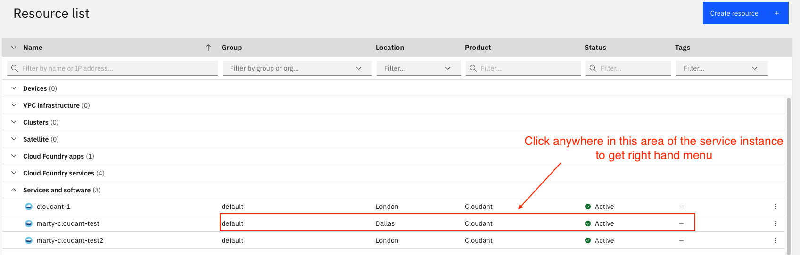

# Credential Rotator Operator

Credential Rotator Operator is a [Kubernetes operator](https://kubernetes.io/docs/concepts/extend-kubernetes/operator/) which automates the rotation of database credentials for a web application.


During setup and deployment of the operator:

- A [custom resource definition](https://kubernetes.io/docs/concepts/extend-kubernetes/api-extension/custom-resources/) (CRD) is created.
- A [controller](https://kubernetes.io/docs/concepts/architecture/controller/) is deployed as a Pod that contains the operator logic.
- A controller is registered with the controller manager for the CRD defined previously. This means any operation on a custom resource (CR) of this type of CRD is handled by the controller.
- [Role-based access control](https://kubernetes.io/docs/reference/access-authn-authz/rbac/) (RBAC) is set up for the CR access.

The new controller enables the credential rotation as follows:

1. The user initiates the rotation by creating a CR instance of the new kind we defined, called `CredentialRotator`.
2. Kubernetes writes the CR to the cluster etcd, just as it does for any resource update.
3. The new controller watches for changes to `CredentialRotator` resources, and springs into action.
4. The controller creates a service resource key for the back-end service in question. This example uses a Cloudant database deployed in the IBM Cloud.
5. The controller updates the Secret with the new resource key.
6. The controller restarts the web application instances, which pull the resource key from the Secret.
7. The controller deletes the previous resource key for Cloudant in the IBM Cloud.

__Note:__ The credential rotator operator is scaffolded using the [Operator SDK](https://sdk.operatorframework.io).

## How to deploy

### Prerequisites

* [Go](https://golang.org/dl/) 1.16 or later
* [Kustomize](https://kubectl.docs.kubernetes.io/installation/kustomize/) 2.0.3 or later
* [kubectl](https://kubernetes.io/docs/tasks/tools/install-kubectl/) 1.18 or later
* [Docker](https://docs.docker.com/get-started/overview/), [Quay](Quay.io) or like
* Kubernetes cluster 1.16+, for example [minikube](https://minikube.sigs.k8s.io/docs/), [kind](https://kind.sigs.k8s.io), [IKS](https://cloud.ibm.com/docs/containers?topic=containers-getting-started) or like
* [IBM Cloud](https://cloud.ibm.com/?cm_sp=ibmdev-_-developer-tutorials-_-cloudreg) account
* Access to an [IBM Cloudant database running as an IBM Cloud service](https://cloud.ibm.com/catalog/services/cloudant/?cm_sp=ibmdev-_-developer-tutorials-_-cloudreg)

### Steps

1. [Deploy a web application and IBM Cloudant database](#1-deploy-a-web-application-and-ibm-cloudant-database)
2. [Clone the Credential Rotator Operator project](#2-clone-the-credential-rotator-operator-project) by cloning the Credential Rotator Operator repository
3. [Compile, build, and push](#3-compile-build-and-push) by using the [Operator SDK CLI](https://sdk.operatorframework.io/) to build the operator image and push it to an image registry
4. [Deploy the operator to your Kubernetes cluster](#4-deploy-the-operator-to-your-kubernetes-cluster)
5. [Test and verify](#5-test-and-verify)

### 1. Deploy a web application and IBM Cloudant database


The application used in this tutorial to demonstrate the Credential Rotator Operator is a sample [Node.js application](https://github.com/IBM-Cloud/get-started-node). With this simple web application, you can add names that are stored in a back-end Cloudant database. The web application is deployed to a Kubernetes cluster and the [Cloudant database](https://cloud.ibm.com/catalog/services/cloudant/?cm_sp=ibmdev-_-developer-tutorials-_-cloudreg) runs as an IBM Cloud service. The web app connects to the database by using service credentials from the Cloudant service. These credentials are stored in a Secret on the cluster where the app is deployed so that it can access them.

The steps to deploy the app are as follows:

1. Initiate access to your Kubernetes cluster you want to deploy the web app and credential rotator operator on

2. Create a namespace (for example, `app-ns`) for deploying the web application into. For namespace `app-ns`:

```bash
$ kubectl create ns app-ns
```

3. Follow the steps in [Deploy to IBM Cloud Kubernetes Service](https://github.com/IBM-Cloud/get-started-node/blob/master/README-kubernetes.md) instructions to deploy the web app to Kubernetes and the Cloudant database to the IBM Cloud.

    __Note:__ Remember to pass the namespace that you created (for example, we used `app-ns` in the sample) when you deploy the app and run commands in the cluster for it.

    __Note:__ In [Build Docker Image](https://github.com/IBM-Cloud/get-started-node/blob/master/README-kubernetes.md#build-docker-image) you can use your own image registry--for example, [Docker Hub](https://hub.docker.com/), [Quay](https://quay.io/) or the like--if you prefer.

    __Note:__ Do NOT follow the steps in the [Clean up](https://github.com/IBM-Cloud/get-started-node/blob/master/README-kubernetes.md#clean-up) section of the instructions since they will remove the web app deployed in your cluster.
    
4. Test whether the deployed web app is working by adding a name to see if it is stored in the database.

    The app uses the service credentials that you created during the [Create a Cloudant database](https://github.com/IBM-Cloud/get-started-node/blob/master/README-kubernetes.md#create-a-cloudant-database) section of the instructions to access the Cloudant service. The Credential Rotator Operator will rotate these credentials later in this tutorial.

### 2. Clone the Credential Rotator Operator project

1. Check your Go version by using the `go version` command. This tutorial is tested with the following Go version:

    ```bash
    $ go version
    go version go1.16.5 darwin/amd64
    ```

2. Next, clone the GitHub repository for the Credential Rotator Operator with the following commands:

    ```bash
    git clone git@github.com:IBM/credential-rotator-operator.git
    cd credential-rotator-operator
    ```

### 3. Compile, build, and push

Now you are ready to compile, build the image of the operator, and push that image to an image repository. You can use the image registry of your choice, but this tutorial uses [Docker Hub](https://hub.docker.com).

#### a. Compile the operator

To compile the code, run the following command in the terminal from your project root:

```bash
make
```

#### b. Build and push your image

__Note:__ You must have an account to a image registry, such as Docker Hub, to be able to push your operator image.

1. If you are using Docker Hub, log in with the `docker login` command.

2. To build the Docker image, run the following command. You can also use the regular `docker build -t` command to build.

    ```bash
    export IMG=docker.io/<username>/credential-rotator-operator:<version>
    make docker-build IMG=$IMG
    ```

    * `<username>` is your image registry (Docker Hub, Quay.io, or such) username.
    * `<version>` is the version of the operator image that you will deploy. Note that each time you make a change to operator code, it is a good practice to increment the version.

3. Push the Docker image to your registry by using following command from your terminal:

    ```bash
    make docker-push IMG=$IMG
    ```

### 4. Deploy the operator to your Kubernetes cluster

1. To deploy the operator, run the following command from your terminal:

    ```bash
    $ make deploy IMG=$IMG
    ```

    The output of the deployment should look like the following:

    ```bash
    ../go/src/github.com/IBM/credential-rotator-operator/bin/controller-gen "crd:trivialVersions=true,preserveUnknownFields=false" rbac:roleName=manager-role webhook paths="./..." output:crd:artifacts:config=config/crd/bases
    cd config/manager && ../go/src/github.com/IBM/credential-rotator-operator/bin/kustomize edit set image controller=docker.io/xxx/credential-rotator-operator:latest
    ../go/src/github.com/IBM/credential-rotator-operator/bin/kustomize build config/default | kubectl apply -f -
    namespace/credential-rotator-operator-system created
    customresourcedefinition.apiextensions.k8s.io/credentialrotators.security.example.com configured
    serviceaccount/credential-rotator-operator-controller-manager created
    role.rbac.authorization.k8s.io/credential-rotator-operator-leader-election-role created
    clusterrole.rbac.authorization.k8s.io/credential-rotator-operator-manager-role created
    clusterrole.rbac.authorization.k8s.io/credential-rotator-operator-metrics-reader created
    clusterrole.rbac.authorization.k8s.io/credential-rotator-operator-proxy-role created
    rolebinding.rbac.authorization.k8s.io/credential-rotator-operator-leader-election-rolebinding created
    clusterrolebinding.rbac.authorization.k8s.io/credential-rotator-operator-manager-rolebinding created
    clusterrolebinding.rbac.authorization.k8s.io/credential-rotator-operator-proxy-rolebinding created
    configmap/credential-rotator-operator-manager-config created
    service/credential-rotator-operator-controller-manager-metrics-service created
    deployment.apps/credential-rotator-operator-controller-manager created
    ```

2. To make sure everything is working correctly, use the `kubectl get pods -n credential-rotator-operator-system` command. If the operator is up and running, you will see output similar to the following example.

    ```bash
    $ kubectl get pods -n credential-rotator-operator-system

    NAME                                                     READY   STATUS    RESTARTS   AGE
    credential-rotator-operator-controller-manager-54c5864f7b-znwws   2/2     Running   0          14s
    ```

### 5. Test and verify

Now it's time to see if the operator can rotate the database credentials and restart the web app instances. This means creating a CR instance.

1. If you created a Secret that contains your Cloudant credentials to manually test the web application outside of the operator, then you must remove the Secret before you test the operator. You can delete the Secret with the following command:

    ```bash
    kubectl delete secret cloudant -n <web-app-namespace>
    ```

    For example, the command for our sample is:

    ```bash
    kubectl delete secret cloudant -n app-ns
    ```

    The operator controller creates a new Secret that is modifiable when the first CR is deployed. The Secret that is created outside of the controller is not compatible with the controller.

2. Update your CR by modifying the `config/samples/security_v1alpha1_credentialrotator.yaml` file to look similar to the following:

    ```yaml
    apiVersion: security.example.com/v1alpha1
    kind: CredentialRotator
    metadata:
      name: credentialrotator-sample
    spec:
      userAPIKey: "<IBM_USER_API_KEY>"
      serviceGUID: "<CLOUDANT_SERVICE_GUID>"
      serviceURL: "<CLOUDANT_SERVICE_ENDPOINT>"
      appName: "my-app"
      appNameSpace: "app-ns"
    ```

    * `<IBM_USER_API_KEY>` is the user API key of the IBM Cloud account where the Cloudant service is running.

        To get the `<IBM_USER_API_KEY>`, go to your [IBM Cloud Dashboard](https://cloud.ibm.com/?cm_sp=ibmdev-_-developer-tutorials-_-cloudreg) and click __Manage > Access(IAM) > API keys__.

        __Note:__ If you did not copy the key details when you created it, you must create a new identity and access management (IAM) key since the details are only available at the time of creation.

        

        In the __Access (IAM)__ navigation menu, click __API keys__ to open the list of your associated API keys.

        

    * `<CLOUDANT_SERVICE_GUID>` is the globally unique identifier (GUID) of the Cloudant service instance.

        To find the `<CLOUDANT_SERVICE_GUID>` service instance, go to the [Resource list](https://cloud.ibm.com/resources/?cm_sp=ibmdev-_-developer-tutorials-_-cloudreg) page, expand __Services and software__, and click the name of your Cloudant service. The service properties panel appears, which includes `GUID` as a property.

        

        Click the __Copy to clipboard__ icon for the `GUID` property.

        

    * `<CLOUDANT_SERVICE_ENDPOINT>` is the endpoint of the Cloudant service instance.

        To find the `<CLOUDANT_SERVICE_ENDPOINT>`, click __View full details__ on the same service properties panel where you found the `GUID` property.

        In the __Manage > Overview__ tab of the full details pages, copy the URL located in the __External endpoint (preferred)__ field.

        

    * `appname` is the name that you set when you deployed the `get-started-node` application to Kubernetes and the Cloudant database by following the [Deploy to Kubernetes on IBM Cloud](https://github.com/IBM-Cloud/get-started-node/blob/master/README-kubernetes.md) instructions.

    * `appNameSpace` is the namespace that you deployed the `get-started-node` application into.

3. Finally, create the CR by running the following command:

    ```bash
    kubectl apply -f config/samples/security_v1alpha1_credentialrotator.yaml
    ```

#### Verify that credential rotation works

1. Open the web application URL in your browser. (As a reminder, it's in the form of `get-started-node-.....containers.appdomain.cloud`.)

    You should be able to enter and save names to the database.

    

2. The web application's Pods should have restarted, as demonstrated by the following sample output:

```console
$ kubectl get pods,replicaset -n app-ns

NAME                                    READY   STATUS    RESTARTS   AGE
pod/get-started-node-5db584f94b-fc6vr   1/1     Running   0          5m22s

NAME                                          DESIRED   CURRENT   READY   AGE
replicaset.apps/get-started-node-5db584f94b   1         1         1       5m23s
replicaset.apps/get-started-node-9df4dbcbf    0         0         0       14m
```

3. Within your Cloudant service's full details pages, select __Service credentials__ from the menu. The list on the __Service credentials__ page should contain a new credential with a timestamp around the time that you created the CR.

    

    __Note:__ You can remove any previous credentials that you don't need. The operator handles the credentials that it creates by replacing the previous credential with the new credential.

Congratulations! You successfully deployed the Credential Rotator Operator and rotated the database credentials for a web application.

#### Cleanup

1. The `Makefile` part of the generated project has a target called `undeploy`, which deletes all of the resources associated with the operator. You can run it with the following command:

```bash
make undeploy
```

2. You can clean up the application by following the steps in [Clean up](https://github.com/IBM-Cloud/get-started-node/blob/master/README-kubernetes.md#clean-up).

__Note:__ Remember to pass the namespace you created (for example `app-ns`) when running commands in the cluster for it.

3. You can delete the Cloudant service similar to [Deleting resource](https://cloud.ibm.com/docs/account?topic=account-delete-resource) in IBM Cloud.

## Troubleshooting

1. To check the progress of the operator controller when handling a request, check the controller manager container log as follows:

    ```bash
    kubectl logs deployment.apps/credential-rotator-operator-controller-manager -c manager -n <operator-namespace> --tail 1 --follow
    ```

    For example:

    ```bash
    kubectl logs deployment.apps/credential-rotator-operator-controller-manager -c manager -n credential-rotator-operator-system --tail 1 --follow
    ```

    __Note:__ Stream the log by adding `--tail 1 --follow` flags to the end of the `logs` command.

2. When you deployed your CR, did you receive output that says it is `unchanged`, similar to the following example?

    ```console
    $ kubectl apply -f config/samples/security_v1alpha1_credentialrotator.yaml

    credentialrotator.security.example.com/credentialrotator-sample unchanged
    ```

    The `unchanged` response means that Kubernetes already has a CR instance `credentialrotator-sample` of type `credentialrotator.security.example.com` and it cannot find any delta between your update and the current instance. Therefore, it will do nothing and the controller will not be called. To get around this, first delete the CR instance as follows:

    ```bash
    kubectl delete -f config/samples/security_v1alpha1_credentialrotator.yaml
    ```

    Then reapply it. Alternatively, you can apply an entirely new CR instance.

## License

This code is licensed under the Apache Software License, Version 2.  Separate third party code objects invoked within this code are licensed by their respective providers pursuant to their own separate licenses. Contributions are subject to the [Developer Certificate of Origin, Version 1.1 (DCO)](https://developercertificate.org/) and the [Apache Software License, Version 2](https://www.apache.org/licenses/LICENSE-2.0.txt).

[Apache Software License (ASL) FAQ](https://www.apache.org/foundation/license-faq.html#WhatDoesItMEAN)
